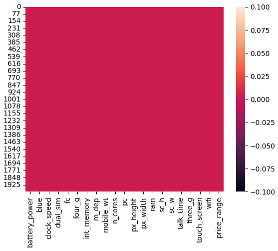
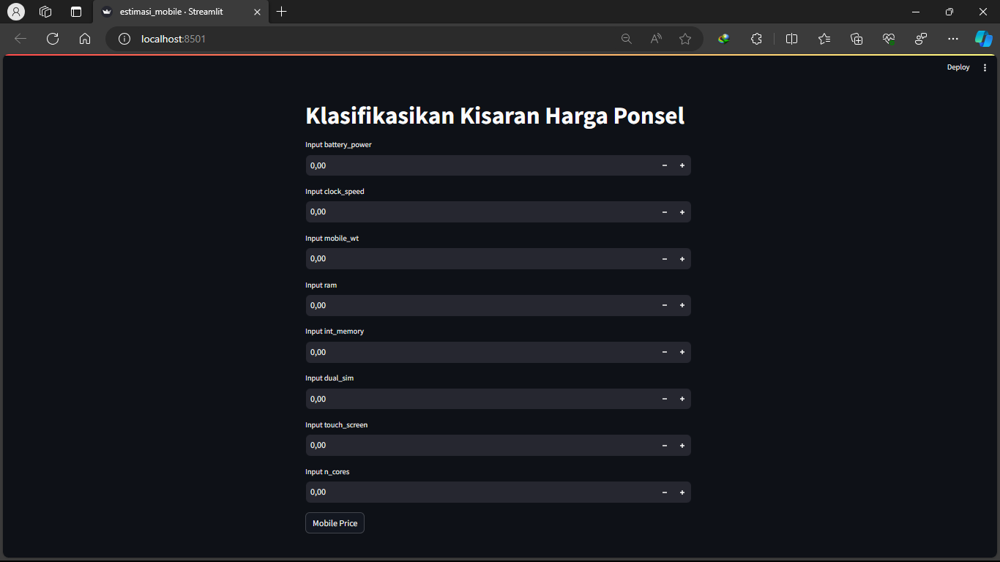

# Laporan Proyek Machine Learning
### Nama : Arif Rahman Hakim
### Nim : 211351025
### Kelas : Pagi A

## Domain Proyek

pengembangan model Machine Learning untuk memprediksi kategori harga ponsel (misalnya, murah, menengah bawah, menengah, atau mahal) berdasarkan fitur-fiturnya. Proyek ini membantu perusahaan ponsel dalam menetapkan harga yang sesuai untuk produk-produk mereka.


## Business Understanding

Proyek ini bertujuan membangun model Machine Learning untuk memprediksi kategori harga ponsel berdasarkan fitur-fiturnya, membantu perusahaan menetapkan harga yang lebih cerdas, dan meningkatkan profitabilitasnya.

Bagian laporan ini mencakup:

### Problem Statements

Mengembangkan model Machine Learning untuk memprediksi kategori harga ponsel berdasarkan fitur-fiturnya guna meningkatkan keputusan penetapan harga perusahaan.


### Goals

**Tujuan:**
1. Membangun model Machine Learning untuk memprediksi kategori harga ponsel berdasarkan fitur-fiturnya.

2. Meningkatkan keputusan penetapan harga perusahaan untuk meningkatkan profitabilitas dan daya saing di pasar ponsel.

    ### Solution statements
    Pernyataan Solusi:

    * Mengumpulkan data penjualan ponsel dan fitur teknisnya.

    * Membangun model Machine Learning untuk memprediksi kategori harga berdasarkan fitur-fitur.

    * Mengintegrasikan model ke dalam keputusan penetapan harga perusahaan.

## Data Understanding
Dataset yang saya gunakan berasal dari [kaggle](https://www.kaggle.com/) yang berisi fitur-fitur guna meningkatkan keputusan untuk penetapan harga perusahaan. Dataset ini berisi sekumpulan data yang dikumpulkan oleh orang yang akan mendirikan perusahaan selulernya sendiri (Bob). Dataset ini mengandung 2001 baris dan 21 kolom<br> 

Dataset: [mobile-price-classification](https://www.kaggle.com/datasets/iabhishekofficial/mobile-price-classification).
 

### Variabel-variabel pada  adalah sebagai berikut:
- battery_power: Kapasitas baterai dalam mAh = Dtype (int64)
- clock_speed: Kecepatan prosesor dalam Hz = Dtype (float64)
- mobile_wt: Berat fisik ponsel dalam gram = Dtype (int64)
- ram: Kapasitas RAM dalam MB atau GB = Dtype (int64 )
- int_memory: Kapasitas memori internal dalam GB = Dtype (int64 )
- dual_sim: Mendukung dua kartu SIM (Ya/Tidak) atau (1/0) = Dtype (int64)
- touch_screen: Memiliki layar sentuh (Ya/Tidak) atau (1/0) = Dtype (int64)
- n_cores: Jumlah inti prosesor = Dtype (int64)

## Data Preparation

```bash
from google.colab import files
files.upload()
```
mengunggah file ke sesi Google Colab dari komputer lokal dengan menggunakan perpustakaan files
```bash
!mkdir -p ~/.kaggle
!cp kaggle.json ~/.kaggle/
!chmod 600 ~/.kaggle/kaggle.json
!ls ~/.kaggle
```
untuk mengatur file kaggle.json agar dapat digunakan dalam sesi Google Colab
```bash
!kaggle datasets download -d iabhishekofficial/mobile-price-classification
```
mengunduh dataset "mobile-price-classification" dari Kaggle ke sesi Google Colab dengan menggunakan perintah kaggle datasets download
```bash
!unzip mobile-price-classification.zip -d mobile
!ls mobile
```
mengekstrak file "mobile-price-classification.zip" ke direktori "mobile" dan menampilkan daftar file dalam direktori tersebut di sesi Google Colab
```bash
import numpy as np
import pandas as pd
import matplotlib.pyplot as plt
import seaborn as sns
```
liblary yang dibutuhkan
Code ini mengimpor pustaka-pustaka umum untuk analisis data dan visualisasi
```bash
df = pd.read_csv("mobile/train.csv")
df.head()
```
membaca file CSV ke dalam DataFrame Pandas dan menampilkan lima baris pertama dari DataFrame tersebut
```bash
df.info()
```
menampilkan informasi dasar tentang DataFrame, seperti tipe data dan jumlah entri dalam setiap kolom
```bash
df.describe()
```
memberikan ringkasan statistik dasar untuk kolom numerik dalam DataFrame.
```bash
sns.heatmap(df.isnull())
```

membuat peta panas yang menunjukkan lokasi nilai-nilai yang hilang dalam DataFrame df.
```bash
sns.heatmap(df.isnull())
```
 menghitung berapa banyak nilai yang hilang dalam setiap kolom DataFrame, tidak ada yang hilang 0
 ```bash
df["price_range"].value_counts()
```
menghitung dan menampilkan jumlah masing-masing nilai yang unik dalam kolom "price_range" dari DataFrame df
```bash
plt.figure(figsize=(16.5, 5.5))
sns.boxplot(x = df['price_range'])
```
 menggambar boxplot yang menunjukkan sebaran data dari kolom 'price_range' dalam DataFrame df
 ```bash
plt.figure(figsize=(20,7))
sns.heatmap(df.corr() , annot = True, cmap = "Blues")
```
membuat peta panas (heatmap) yang menunjukkan korelasi antara kolom-kolom dalam DataFrame df

## Modeling
 ```bash
from sklearn.model_selection import train_test_split
from sklearn.linear_model import LinearRegression
```
 mengimpor modul yang digunakan dalam pemodelan regresi linear dengan scikit-learn.
 ```bash
['battery_power','clock_speed','mobile_wt','ram','int_memory','dual_sim','touch_screen','n_cores']
x = df[features]
y = df['price_range']
x.shape, y.shape
```
memilih beberapa fitur dari DataFrame df, memisahkan mereka sebagai dataset fitur x, dan memilih kolom 'price_range' sebagai target y. Selanjutnya, x.shape dan y.shape menunjukkan dimensi data x dan y
 ```bash
x_train, X_test, y_train, y_test = train_test_split(x,y,random_state=70)
y_test.shape
```
membagi data menjadi set pelatihan dan pengujian, kemudian menunjukkan dimensi data y_test
 ```bash
lr = LinearRegression()
lr.fit(x_train,y_train)
pred = lr.predict(X_test)
```
membuat model regresi linear, melatih model dengan data pelatihan, dan kemudian menggunakan model untuk membuat prediksi dengan data pengujian
 ```bash
score = lr.score(X_test, y_test)
print('akurasi model regresi linier = ', score)
```
untuk menghitung dan mencetak akurasi dari model regresi linier pada data uji
 ```bash
price_range_mapping = {
    0: 'Murah',
    1: 'Menengah Bawah',
    2: 'Menengah',
    3: 'Mahal'
}
```
Ini adalah daftar yang menghubungkan angka (0, 1, 2, 3) dengan kategori harga ponsel ( 'Murah', 'Menengah Bawah', 'Menengah', 'Mahal')
 ```bash
df['price_range'] = df['price_range'].map(price_range_mapping)
```
mengonversi nilai numerik dalam kolom 'price_range' menjadi label kategori harga ponsel menggunakan kamus price_range_mapping
 ```bash
# Data input
input_data = np.array([[1021, 0.5, 136, 2631, 53, 1, 1, 3]])

# Hasil prediksi dari model
prediction = lr.predict(input_data)

# Bulatkan hasil prediksi ke integer
rounded_prediction = int(round(prediction[0]))

# Membuat pemetaan nilai price_range
price_range_mapping = {
    0: 'Murah',
    1: 'Menengah Bawah',
    2: 'Menengah',
    3: 'Mahal'
}

# Memetakan hasil prediksi ke dalam deskripsi price_range
predicted_price_range = price_range_mapping[rounded_prediction]

# Output deskripsi price_range
print("Price Range: ", predicted_price_range)
```
memprediksi kategori harga ponsel hasil 2 (menengah)
 ```bash
import pickle

filename = 'estimasi_mobile.sav'
pickle.dump(lr,open(filename,'wb'))
```
Kode ini menyimpan model regresi linier (lr) ke dalam file 'estimasi_mobile.sav' menggunakan modul pickle.
## Evaluation
saya mengunakan linearRegression
 ```bash
lr = LinearRegression()
lr.fit(X_train, y_train)

y_pred = lr.predict(X_test)

score = lr.score(X_test, y_test)
print('Akurasi model regresi linier =', score)

```
saya mendapatkan akurasi model regresi linier =  0.8786407131642229 menunjukkan bahwa model hampir 88% menjelaskan variasi dalam data harga ponsel, yang merupakan hasil yang baik dalam konteks regresi linier.

## Deployment
 [mobile price classification](https://appmobile-djhxhp8scfkkqkehaahbm5.streamlit.app/).

